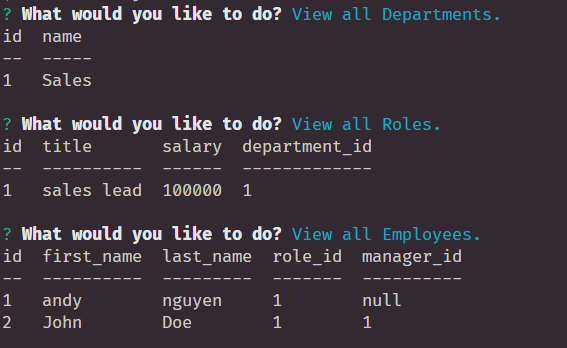
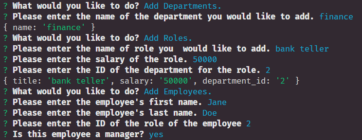
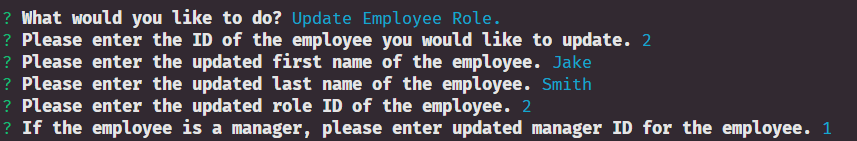
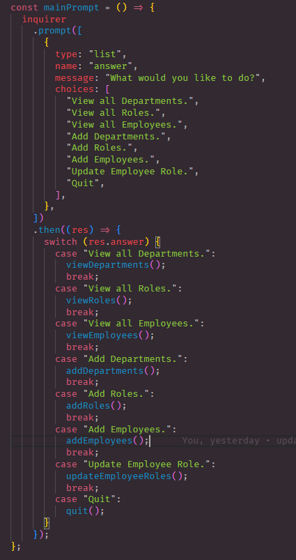
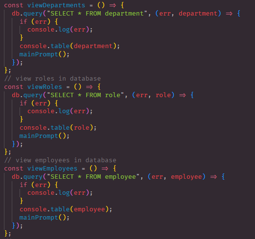
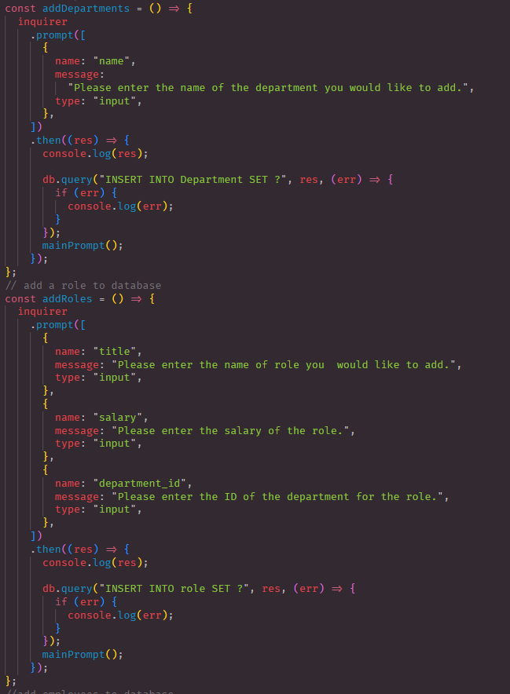
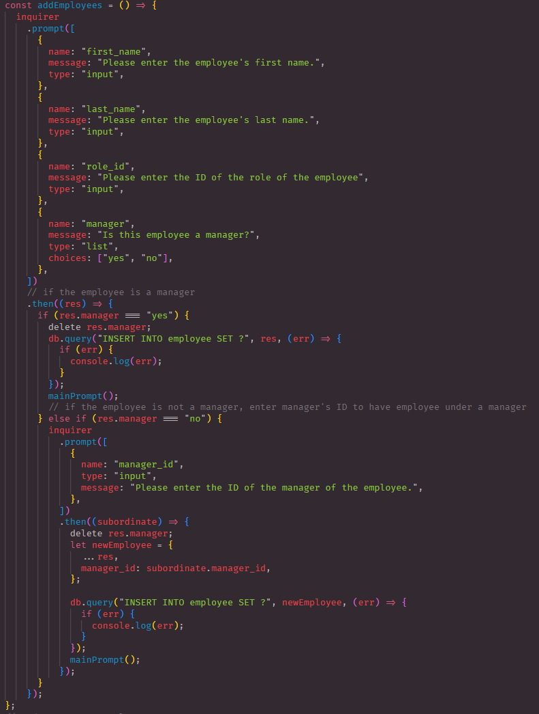
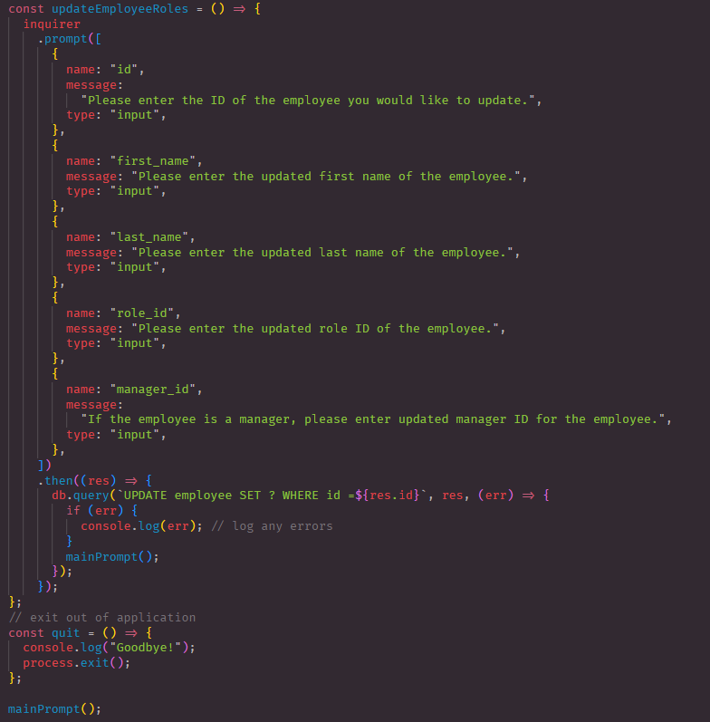

# Employee Tracker
By: Thandyn
Email: nguyenphuthan@gmail.com

## Description
This project is for business owners who want to view and manager the departments, roles

## Table of Content 
  - [Installation](#installation)
  - [Usage](#usage)
  - [Questions](#questions)
  - [License](#license)
  - [Contribute](#contribute)
  - [Test](#test)

## Installation
To install project, go to the terminal and type "npm i". This package will include inquirer, mysql2, and console table. Also incuded is sequelize and dotenv but we won't be using that.
## Usage
To invoke in terminal, type in "node index.js. A prompt will show and in there you can view and add any departments, roles, and employees.

This is the table users will see when they view any of the departments, roles, and employees.

These are the prompts asked if users were to add any of the departments, roles, and employees.

This is the prompt asked if user wanted to update an employee. 

In this block of code, I used inquirer to ask users in a menu of prompt what they will like to do. Each prompt have a separate function to do different functionality. 

These code are all similar just to show the database using mysql2. 

For all of the prompts that does the add functionality, I start off by asking a prompt for users to add new data to the database.

This code is for adding employees. First the prompt will ask for the newly added employees information. When it gets to the prompt asking if the employee is a manager, this prompt is asked in a list type. If users wanted to set employee as manager, It will set the employee as manager. If users wanted to set employee just as employee, the next prompt will ask which manager the employee is under. If the manager's ID do not exist, it will not add the employee. Make sure newly added employee is under the correct manager ID. 

Update employee's role will ask a series of prompt to update. Users will have to select employee by their ID to change their information and it will override all old information. Last function is to quit out of the application. 
## License
None

## Contribute
If you wish to contribute, please contact me at my email. 

## Test
To run test, open terminal and enter "node index.js" to invoke. A prompt will appear and users can navagate using the arrow keys.

## Questions
If you have any questions, please email me at: . 
For more information, please visit my Github link: https://github.com/Thandyn/.
